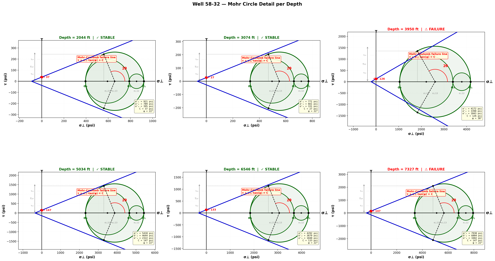
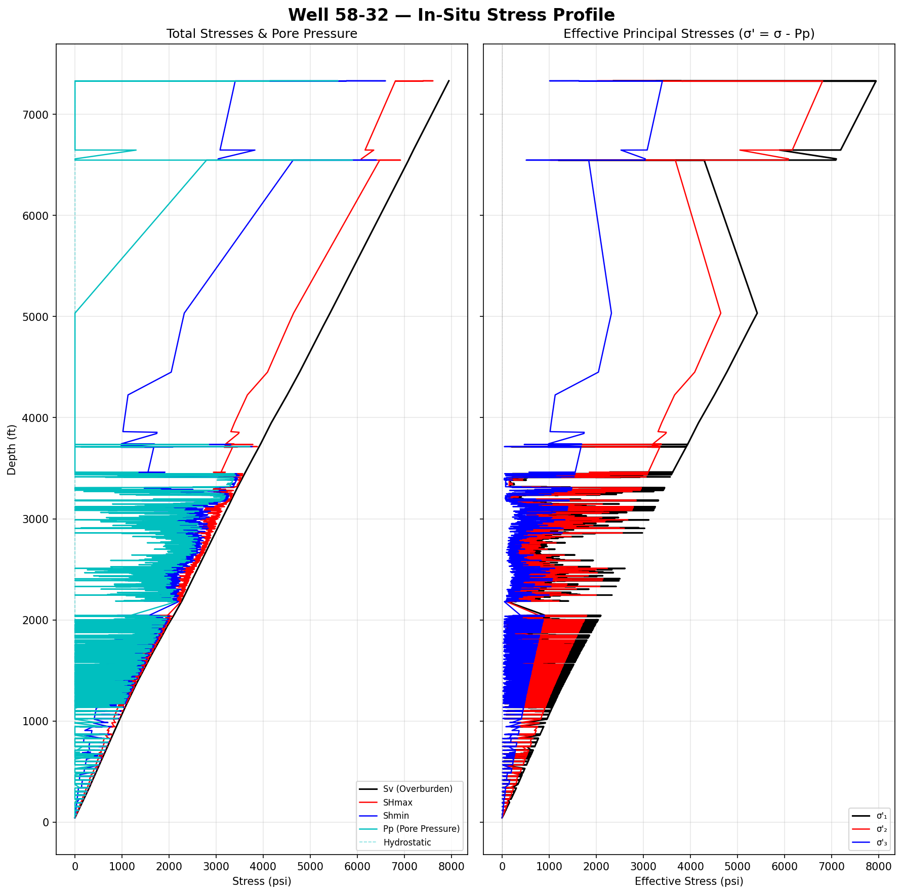
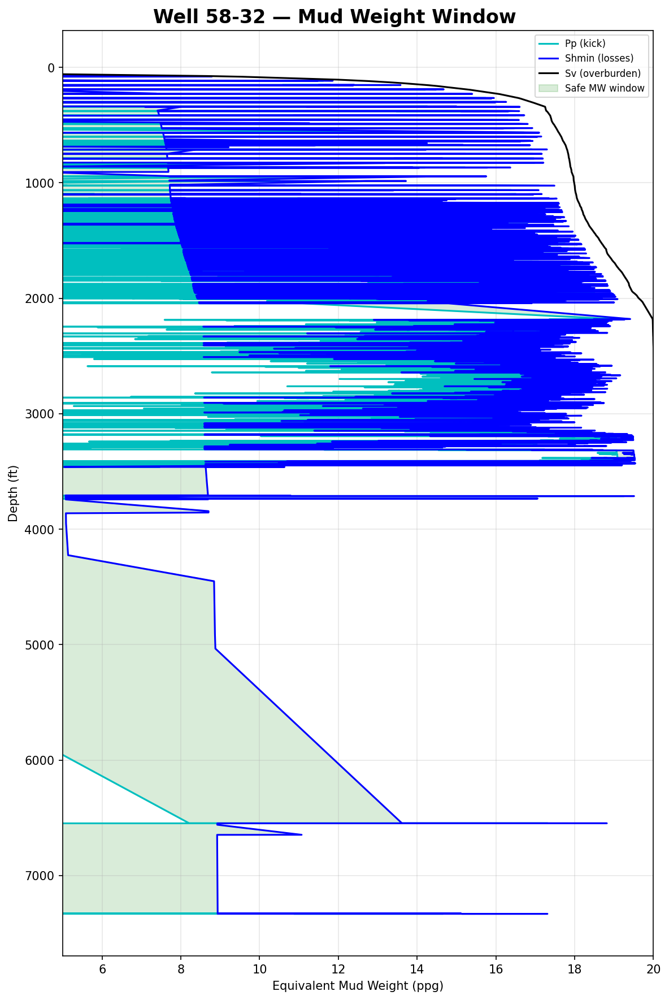
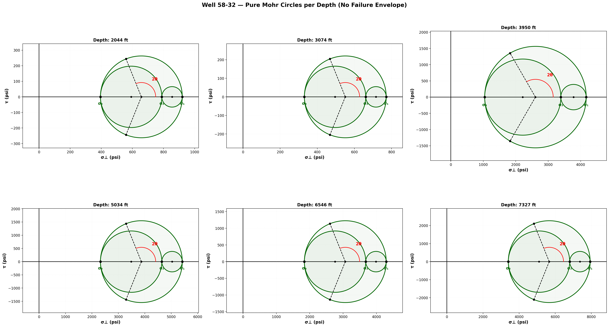
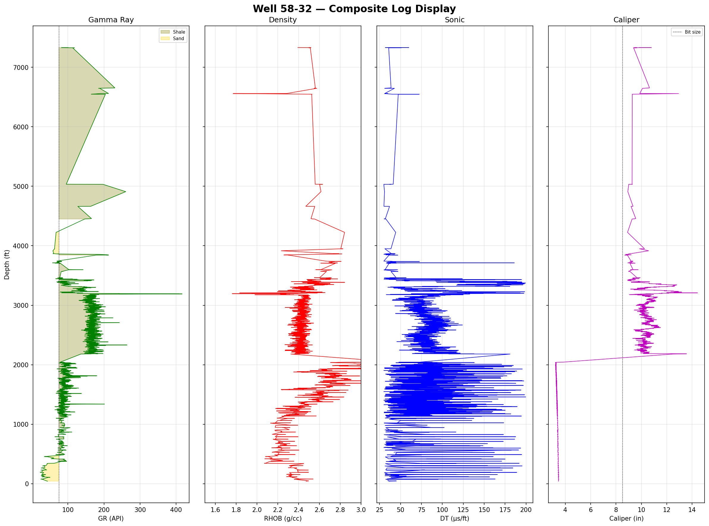
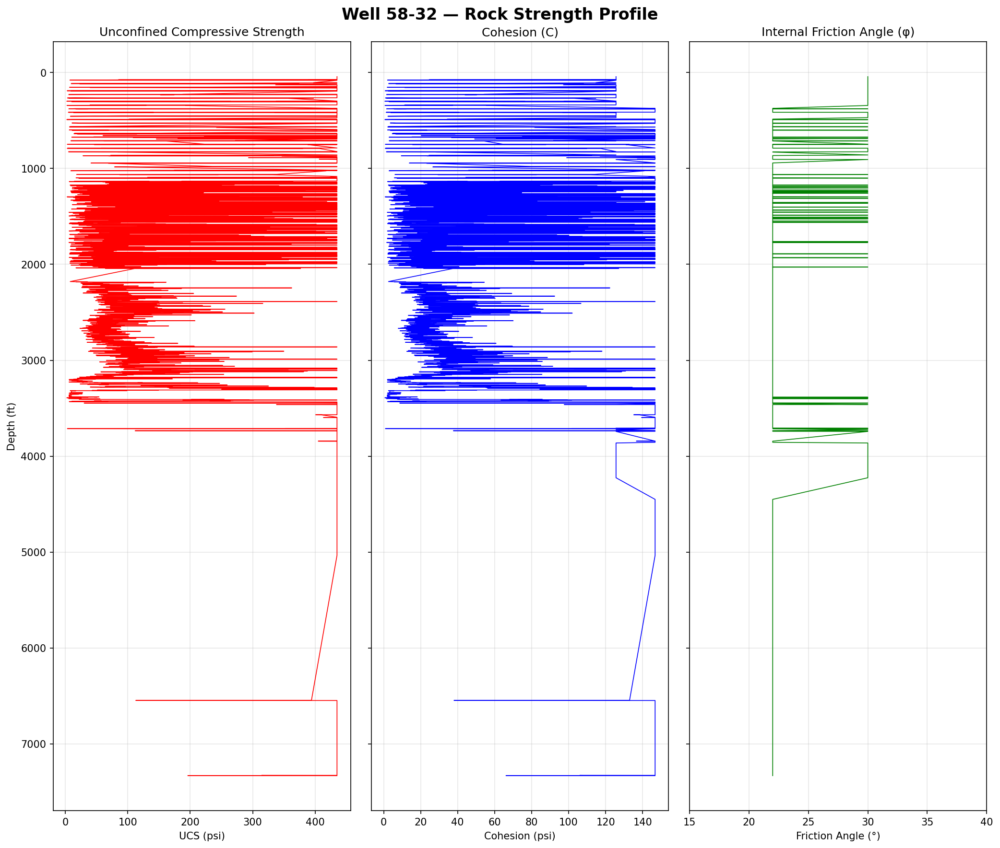
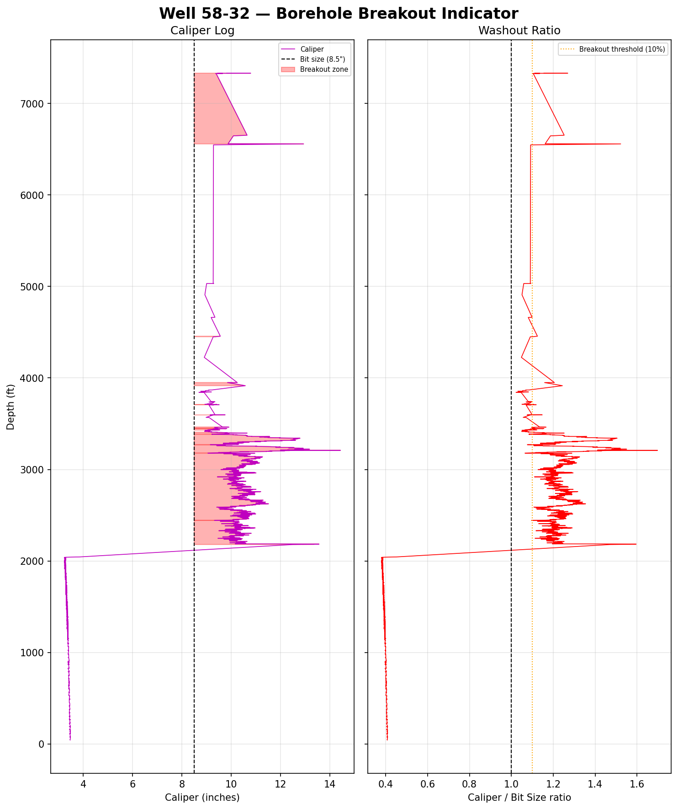
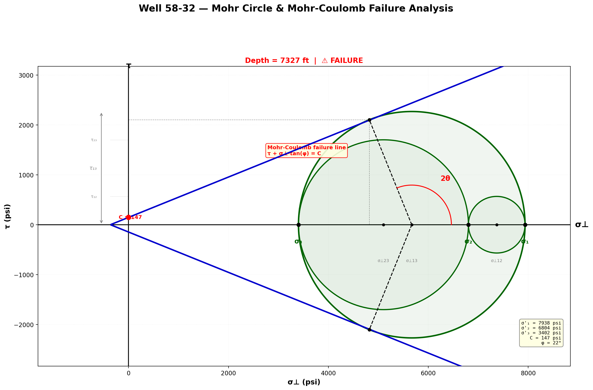

# 1D Geomechanical Stress Modeling & Mohr-Coulomb Failure Analysis










## Overview
This repository contains a complete pipeline for constructing a 1D Geomechanical Model from raw borehole logging data (Well 58-32 Main). The workflow processes acoustic, density, and gamma-ray well logs to compute the principal in-situ stresses and estimate empirical rock strength, culminating in a mathematically rigorous Mohr-Coulomb wellbore stability analysis.

## Methodology

### 1. Principal Stress Computations
The foundation of the 1D model hinges on translating raw well log parameters into the three principal subsurface stresses ($\sigma_v$, $\sigma_{hmin}$, $\sigma_{Hmax}$) and pore pressure ($P_p$).
- **Overburden Stress ($S_v$)**: Computed by integrating the bulk density log (`RHOB`) from surface to total depth. An extrapolated density function is applied to shallow depths lacking data.
- **Pore Pressure ($P_p$)**: Estimated using the Eaton Sonic method. Baseline normal compaction trends are dynamically fitted against the primary compressional slowness (`DT`), allowing identification of over-pressured zones where the sonic transit time deviates from the normal trend.
- **Minimum Horizontal Stress ($S_{hmin}$)**: Derived from the poroelastic horizontal strain equation using lithology-dependent Poisson's ratios, calibrated against Gamma Ray (`GR`) shale cutoffs.
- **Maximum Horizontal Stress ($S_{Hmax}$)**: Modeled using a calibrated lateral stress coefficient / regional tectonic stress ratio assumption.

### 2. Empirical Rock Strength & Calibration
Compressive rock strengths (UCS) and cohesion ($C$) are estimated using established empirical correlations (e.g., Horsrud for shales, McNally for sandstones) derived from the compressional sonic log. 

**Note on Calibration:** Raw sonic correlations inherently over-predict in-situ rock strength. To align the theoretical stability model with observed wellbore behaviors (e.g., breakouts observed via caliper or image logs), an empirical calibration factor is applied to the raw UCS outputs. This forces the mathematical cohesion down to the field-verified breakout limit, ensuring the failure envelope tangency aligns with physical observations.

### 3. Mohr-Coulomb Failure Geometry
A core feature of this analysis is the automated construction of depth-specific Mohr circles and corresponding Mohr-Coulomb failure envelopes. 
The script maps the three principal effective stresses ($\sigma'_1$, $\sigma'_2$, $\sigma'_3$) into Mohr space and precisely calculates the critical fracture mechanisms:
- Identifies the upper and lower conjugate failure planes at the theoretical fracture angle ($2\theta = 90^\circ + \phi$).
- Projects accurate, symmetric radial dashed lines intersecting the dynamic tangent points on the failure envelope.
- Constructs "Pure Mohr Circle" visualizations to exclusively analyze 3D principal stress geometry absent of internal fault criteria.

## Usage
Ensure the primary log file (`geomechanics_results.csv` or similar raw borehole export) is located in the working directory alongside the main script. 
Execute the core pipeline:
```bash
python index.py
```
This generates all diagnostic plots locally and exports a fully populated `.csv` containing the depth-indexed effective stresses, strength bounds, and identified failure depths.
